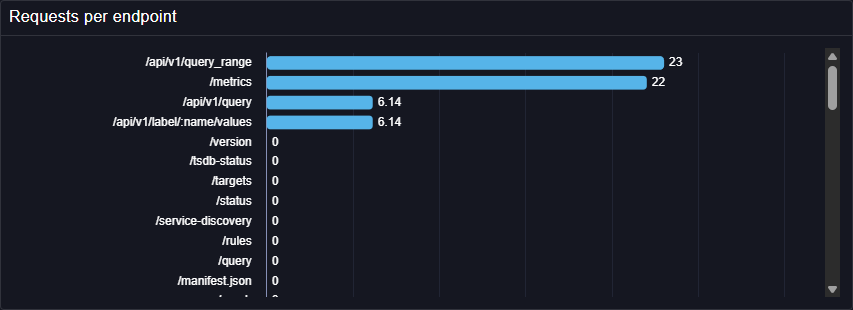

# Bar Chart

The Bar Chart plugin displays time series or tabular values as bars, making it easy to compare categories, rankings, and top-N views in Perses dashboards.

See also technical docs related to this plugin:

- [Data model](./model.md)
- [Dashboard-as-Code Go lib](./go-sdk.md)
