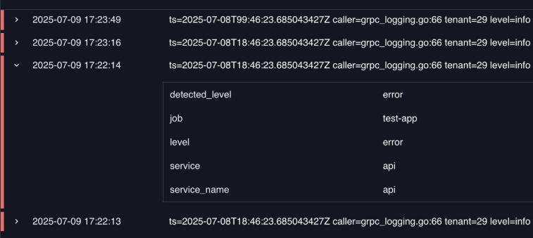

# Logs Table

The Logs Table plugin displays log entries in a tabular format in Perses dashboards. This panel plugin provides structured viewing of log data with support for filtering and formatting.

## Main customizations

- **General settings**: configure table-wide behavior like legend display & thresholds.
- **Item actions**: add row/item selection actions to trigger links or interactions from selected items.

## References

See also technical docs related to this plugin:

- [Data model](./model.md)
- [Dashboard-as-Code Go lib](./go-sdk.md)
