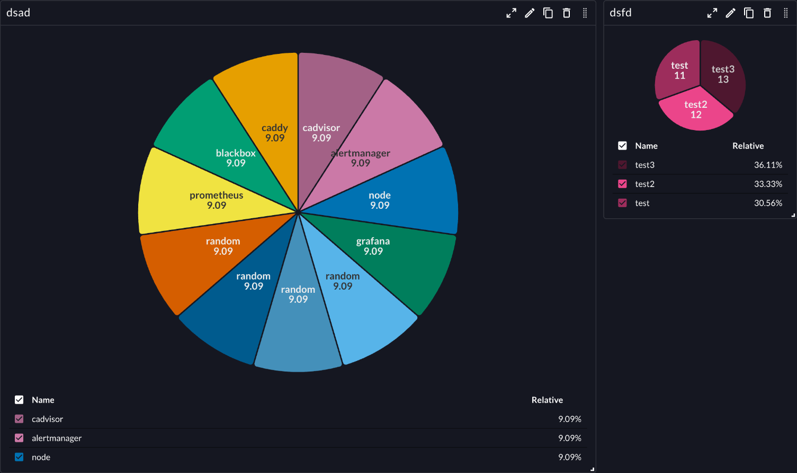

# Pie Chart

The Pie Chart plugin displays data as a circular pie chart in Perses dashboards. This panel plugin is useful for showing proportional data and parts of a whole.

See also technical docs related to this plugin:

- [Data model](./model.md)
- [Dashboard-as-Code Go lib](./go-sdk.md)
