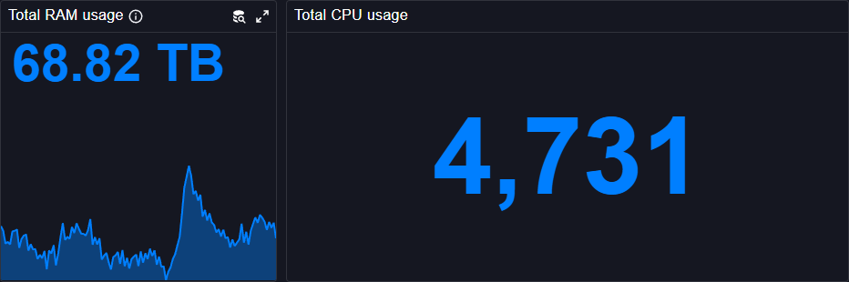

# Stat Chart

The Stat Chart plugin displays single value statistics with optional sparklines in Perses dashboards. This panel plugin is ideal for showing key performance indicators (KPIs) and summary metrics.

## Main customizations

- **General settings**: configure legend, various visual settings & thresholds.
- **Value mapping**: define conditional formatting rules to change e.g the color or the text displayed based on the value.

## References

See also technical docs related to this plugin:

- [Data model](./model.md)
- [Dashboard-as-Code Go lib](./go-sdk.md)
