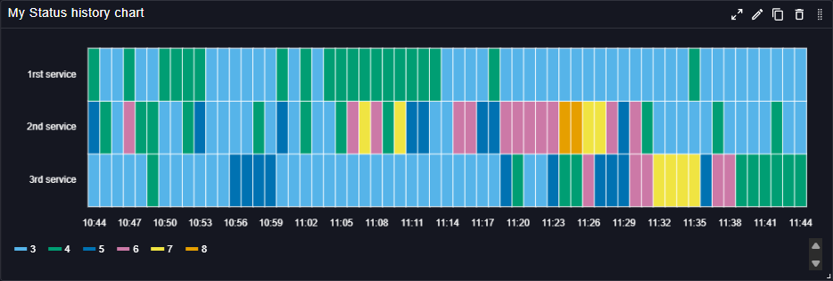

# Status History Chart

The Status History Chart plugin displays the status history of services or components over time. It allows users to track changes in the status of different metrics, making it easier to identify patterns, trends, and anomalies. It is then particularly useful for monitoring the health and performance of systems, as it can display status changes in a clear and concise manner.

This panel can be customized to show different statuses, such as up, down, warning, or any other user-defined states, and it supports various visualization options to enhance the readability of the data.

## Main customizations

- **General settings**: configure legend & sorting.
- **Value mapping**: define conditional formatting rules to change e.g the color or the text displayed based on the value.

## References

See also technical docs related to this plugin:

- [Data model](./model.md)
- [Dashboard-as-Code Go lib](./go-sdk.md)
