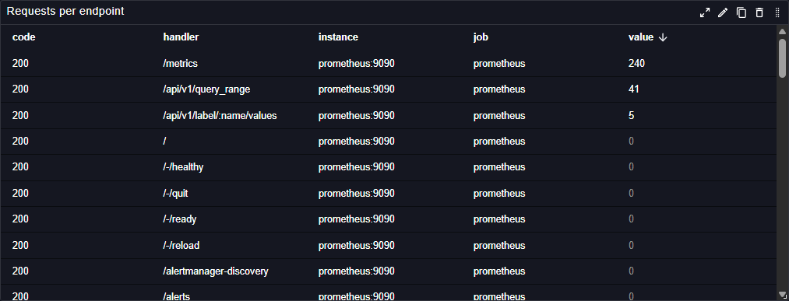

# Table

The Table plugin displays data in a structured tabular format in Perses dashboards. This panel plugin provides flexible table visualization with support for sorting, formatting, and custom columns.

## Main customizations

- **General settings**: configure table-wide behavior like pagination and column filtering.
- **Column settings**: customize each column independently (for example configure unit & visibility, add external link, define conditional formatting rules).
- **Cell settings**: define conditional formatting rules that apply globally across matching cells.
- **Item actions**: add row/item selection actions to trigger links or interactions from selected items.
- **Transformations**: define transformations to manipulate data before rendering

## Transformations

Transformations let you run post-processing on data after it is retrieved from the backend and before it is rendered. They are especially useful for applying manipulations that the queried backend does not support.

The Table panel supports multiple kind of transformations:

### Merge columns

This transformation allows to merge multiple columns into a single one.

Before:

| timestamp  | value #1 | value #2 | mount #1  | mount #2  |
|------------|----------|----------|-----------|-----------|
| 1630000000 | 1        |          | /         |           |
| 1630000000 | 2        |          | /boot/efi |           |
| 1630000000 |          | 3        |           | /         |
| 1630000000 |          | 4        |           | /boot/efi |

After:

| timestamp  | MERGED | mount #1  | mount #2  |
|------------|--------|-----------|-----------|
| 1630000000 | 1      | /         |           |
| 1630000000 | 2      | /boot/efi |           |
| 1630000000 | 2      |           | /         |
| 1630000000 | 3      |           | /boot/efi |

### Merge series

This transformation merges series that define the same labels

Before:

| timestamp  | value #1 | value #2 | mount #1  | mount #2  | instance #1 | instance #2 | env #1 | env #2 |
|------------|----------|----------|-----------|-----------|-------------|-------------|--------|--------|
| 1630000000 | 1        |          | /         |           | test:44     |             | prd    |        |
| 1630000000 | 2        |          | /boot/efi |           | test:44     |             | prd    |        |
| 1630000000 |          | 5        |           | /         |             | test:44     |        | prd    |
| 1630000000 |          | 6        |           | /boot/efi |             | test:44     |        | prd    |

After:

| timestamp  | value #1 | value #2 | mount     | instance | env |
|------------|----------|----------|-----------|----------|-----|
| 1630000000 | 1        | 5        | /         | test:44  | prd |
| 1630000000 | 2        | 6        | /boot/efi | test:44  | prd |

### Merge indexed columns

This transformation merges all indexed columns into a single one.

Before:

| timestamp #1 | timestamp #2 | value #1 | value #2 | instance #1 | instance #2 |
|--------------|--------------|----------|----------|-------------|-------------|
| 1630000000   |              | 55       |          | toto        |             |
| 1630000000   |              | 33       |          | toto        |             |
| 1630000000   |              | 45       |          | toto        |             |
|              | 1630000000   |          | 112      |             | titi        |
|              | 1630000000   |          | 20       |             | titi        |
|              | 1630000000   |          | 10       |             | titi        |

After merge with column="value":

| timestamp #1 | timestamp #2 | value | instance #1 | instance #2 |
|--------------|--------------|-------|-------------|-------------|
| 1630000000   |              | 55    | toto        |             |
| 1630000000   |              | 33    | toto        |             |
| 1630000000   |              | 45    | toto        |             |
|              | 1630000000   | 112   |             | titi        |
|              | 1630000000   | 20    |             | titi        |
|              | 1630000000   | 10    |             | titi        |

### Join by column value

This transformation merges rows that have equal cell value in the given column.
If there are multiple lines with same value, next row values override the current one.

Before:

| timestamp #1 | timestamp #2 | value #1 | value #2 | instance |
|--------------|--------------|----------|----------|----------|
| 1630000000   |              | 150      |          | toto     |
| 1630000000   |              | 10       |          | toto     |
| 1630000000   |              | 45       |          | toto     |
|              | 1630000000   |          | 1        | titi     |
|              | 1630000000   |          | 99       | titi     |
|              | 1630000000   |          | 10       | titi     |

After join on column "instance":

| timestamp #1 | timestamp #2 | value #1 | value #2 | instance |
|--------------|--------------|----------|----------|----------|
| 1630000000   |              | 45       |          | toto     |
|              | 1630000000   |          | 10       | titi     |

Other example with join on "mount":

Before:

| timestamp  | value #1 | value #3 | mount     |
|------------|----------|----------|-----------|
| 1630000000 | 1        |          | /         |
| 1630000000 | 2        |          | /boot/efi |
| 1630000000 |          | 3        | /         |
| 1630000000 |          | 4        | /boot/efi |

After:

| timestamp  | value #1 | value #3 | mount     |
|------------|----------|----------|-----------|
| 1630000000 | 1        | 3        | /         |
| 1630000000 | 2        | 4        | /boot/efi |

## References

See also technical docs related to this plugin:

- [Data model](./model.md)
- [Dashboard-as-Code Go lib](./go-sdk.md)
