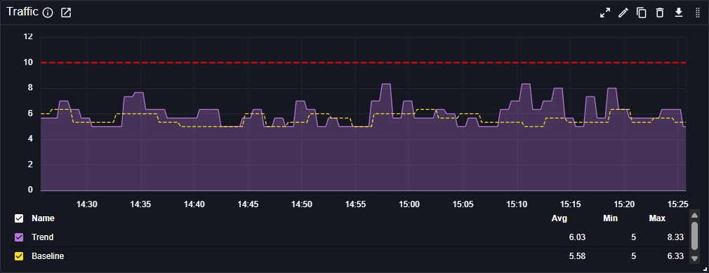

# Time Series Chart

The Time Series Chart plugin displays time series data as line charts in Perses dashboards. This panel plugin is one of the most commonly used visualization types for monitoring metrics over time.

## Main customizations
 
- **General settings**: configure legend, various visual settings, Y axis, thresholds..
- **Query settings**: define per-query customizations to have e.g different styling or unit for different trends.

## References

See also technical docs related to this plugin:

- [Data model](./model.md)
- [Dashboard-as-Code Go lib](./go-sdk.md)
